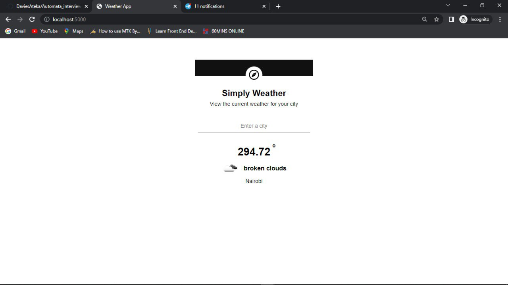

## Weather app using Express and ejs

Automata Task
Using public APIs from https://api.publicapis.org/, integrate these
APIs to an ejs sample Web client that you will create. You will use
a design of your own and how you will display this data on your
frontend (perform simple CRUD operations). 

For the crud part you can git clone the master and use the EJS folder which is basically the CRUD ellaboration using ejs, node js and mysql.

